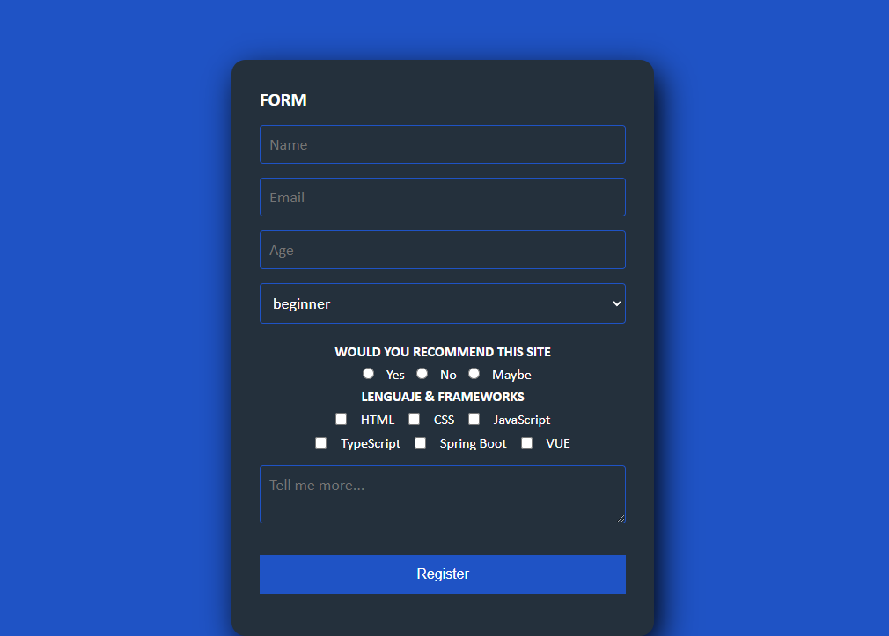
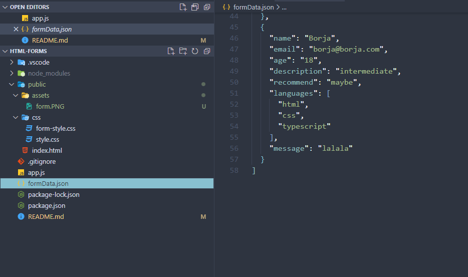

# HTML-Forms

Este es un formulario web creado con Express, que recoge datos y los guarda en un archivo JSON. Se podra utilizar como marco para aplicaciones más completas.

<div>
    <h3>FORMULARIO PRINCIPAL</h3>
    
    <h3>RESULTADO TRAS MANDAR EL FORMULARIO</h3>
    
</div>


## Instalación
Clona este repositorio: 
```
git clone https://github.com/BarmanDev/HTML-Forms
```
Instala las dependencias:
```
npm install
```
Ejecuta la aplicación:
```
node app.js
```
Abre tu navegador y visita 
```
http://localhost:3000
```
